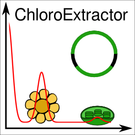
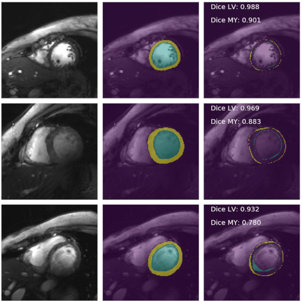
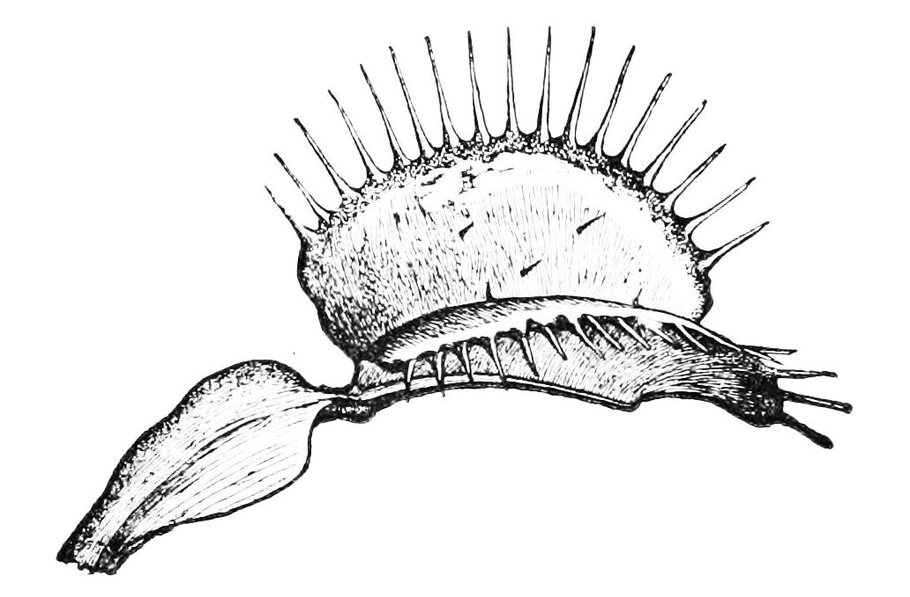

# Projects

## Data Science Meetups and Events

### HackyHour

- **Date**: Every 4th Thursday of the month at 5pm
- **Website**: https://hackyhour.github.io/Wuerzburg
- **Pad**: https://go.uniwue.de/hackyhour-pad

### Data Dojo

- **Date**: Every 2nd Thursday of the month at 6pm
- **Website**: https://ddojo.github.io
- **Pad**: https://go.uniwue.de/ddojo-pad

### Data Crunch Cup Würzburg

- **Date**: April (before the summer semester starts)
- **Website**: https://dccw.de

### Software Carpentry Workshops

- **Website**: https://software-carpentry.org/
- **Local Chapter**: https://github.com/swcarpentry-wuerzburg

### Wue-RSE - *Würzburg Research Software Engineers*

- **de-RSE**: https://de-rse.org
- **Local Chapter**: https://de-rse.org/chapter/wue

### ESF ZDEX

- **Website**: https://www.uni-wuerzburg.de/sft/esf-zdex
- **Our Network**: https://www.uni-wuerzburg.de/sft/esf-zdex/netzwerk-bildanalyse-visualisierung-und-modellierung-komplexer-systeme/

## Data Analytics Tools

### misas - *Model Interpretation through Sensitivity Analysis for Segmentation*

- **Repo**: https://github.com/chfc-cmi/misas
- **Docs**: https://chfc-cmi.github.io/misas/`
- **Paper**: 

### TBro - *Transcriptome Browser*

- **Idea**: visualization and management of de novo transcriptomes
- **Online**: https://tbro.carnivorom.com/
- **Repo**: https://github.com/TBroTeam/TBro
- **Paper**: 

### FENNEC - *Functional Exploration of Natural Networks and Ecological Communities*

- **Online**: https://fennec.molecular.eco
- **Repo**: https://github.com/molbiodiv/fennec
- **Docs**: https://fennec.readthedocs.io/
- **Paper**: 

### AliTV - *Alignment Toolbox and Visualization*

- **Online**: https://alitvteam.github.io/AliTV/d3/AliTV.html
- **Repo**: https://github.com/AliTVTeam/AliTV
- **Docs**: https://alitv.readthedocs.io/en/latest
- **Paper**: 

### bcgTree - *Bacterial Core Genome Tree*

- **Repo**: https://github.com/molbiodiv/bcgTree
- **Paper**: 

### bcdatabaser - *Barcode Database Builder*

- **Online**: https://bcdatabaser.molecular.eco
- **Repo**: https://github.com/molbiodiv/bcdatabaser
- **Paper**: 

### chloroExtractor - *Chloroplast Genome Extractor*

- **Repo**: https://github.com/chloroExtractorTeam/chloroExtractor
- **Paper**: 
- **Benchmark**: 

### biojs-io-biom - *Biological Observation Matrix Format in JavaScript*

- **Repo**: https://github.com/https://github.com/molbiodiv/biojs-io-biom/
- **Online**: https://biomcs.iimog.org
- **Paper**: 

### ITS2 Database Update - *Internal Transcribed Spacer 2 Database Update*

- **Online**: http://its2.bioapps.biozentrum.uni-wuerzburg.de/
- **Paper**: 

## Highlight Papers

### Deep learning-based cardiac cine segmentation: Transfer learning application to 7T ultrahigh-field MRI

- **Repo**: https://github.com/chfc-cmi/cmr-seg-tl
- **Data**: 
- **Paper**: 

### Pollen Metabarcoding

<small>Image Credit: NASA/Goddard Space Flight Center , [Source](https://svs.gsfc.nasa.gov/10394) </small>

- **Repo**: https://github.com/molbiodiv/meta-barcoding-dual-indexing
- **Evaluation Paper**:  - *Evaluating multiplexed next-generation sequencing as a method in palynology for mixed pollen samples*
- **Dual-Indexing Paper**:  - *Increased efficiency in identifying mixed pollen samples by meta-barcoding with a dual-indexing approach*

### Venus Flytrap - *Dionaea muscipula* - Genome and Transcriptome

<small>Image: Public Domain, [Source](https://commons.wikimedia.org/wiki/File:PSM_V08_D065_Dionaea_muscipula.jpg)</small>

- **Transcriptome Browser**: https://tbro.carnivorom.com
- **Transcriptome Paper**:  - *Venus flytrap carnivorous lifestyle builds on herbivore defense strategies*
- **Genome Paper**:  - *Genomes of the Venus flytrap and close relatives unveil the roots of plant carnivory*

### Open Science principles for accelerating trait-based science across the Tree of Life

- **OpenTraits Network**: https://opentraits.org/
- **Paper**: 

## Fun and Hobby Projects

### X Game Manager (App)

- **Repo**: https://github.com/iimog/x-game-master
- **Google Play**: https://play.google.com/store/apps/details?id=org.iimog.xapp

### Hot Wire

### X Party Game

- **Repo**: https://github.com/iimog/x-party-game

## Minor Contributions

### gggenomes - *A ggplot2 Extension for Plotting Genomic Information*

- **Repo**: https://github.com/thackl/gggenomes
- **Docs**: https://thackl.github.io/gggenomes/

### NixOS packages

- **Repo**: https://github.com/NixOS/nixpkgs/
- **Website**: https://nixos.org/
- **Maintainer for**: `dcmtk`, `hmmer`, `seaview`