### Hi there 👋

I’m Markus, a Bioinformatician at the [Center for Computational and Theoretical Biology (CCTB)](https://www.biozentrum.uni-wuerzburg.de/cctb/cctb/) at the [University of Würzburg](https://www.uni-wuerzburg.de).

My research interests are the development and application of algorithms, tools and workflows to generate knowledge from biomedical data. Currently, my focus is on the possibilities and limitations of machine learning and artificial inteligence in biomedical research. Additionally, I engage in knowledge transfer with local businesses as part of the [ESF-ZDEX Project](https://www.uni-wuerzburg.de/sft/esf-zdex/).

- 💻 Projects and Activities: [Overview](https://github.com/iimog/iimog/blob/main/Projects.md)
- 🧑‍🔬 Scientific Papers: [Google Scholar](https://scholar.google.de/citations?user=Qroex8UAAAAJ)
- 🕵️ Reviews: [Publons](https://publons.com/researcher/421873/markus-j-ankenbrand/)
- 🍕 Meetups: [HackyHour Würzburg](https://hackyhour.github.io/Wuerzburg/), [Data Dojo](https://ddojo.github.io/)

<!--
**iimog/iimog** is a ✨ _special_ ✨ repository because its `README.md` (this file) appears on your GitHub profile.

Here are some ideas to get you started:

- 🔭 I’m currently working on ...
- 🌱 I’m currently learning ...
- 👯 I’m looking to collaborate on ...
- 🤔 I’m looking for help with ...
- 💬 Ask me about ...
- 📫 How to reach me: ...
- 😄 Pronouns: ...
- ⚡ Fun fact: ...
-->

### Projects and Activities

[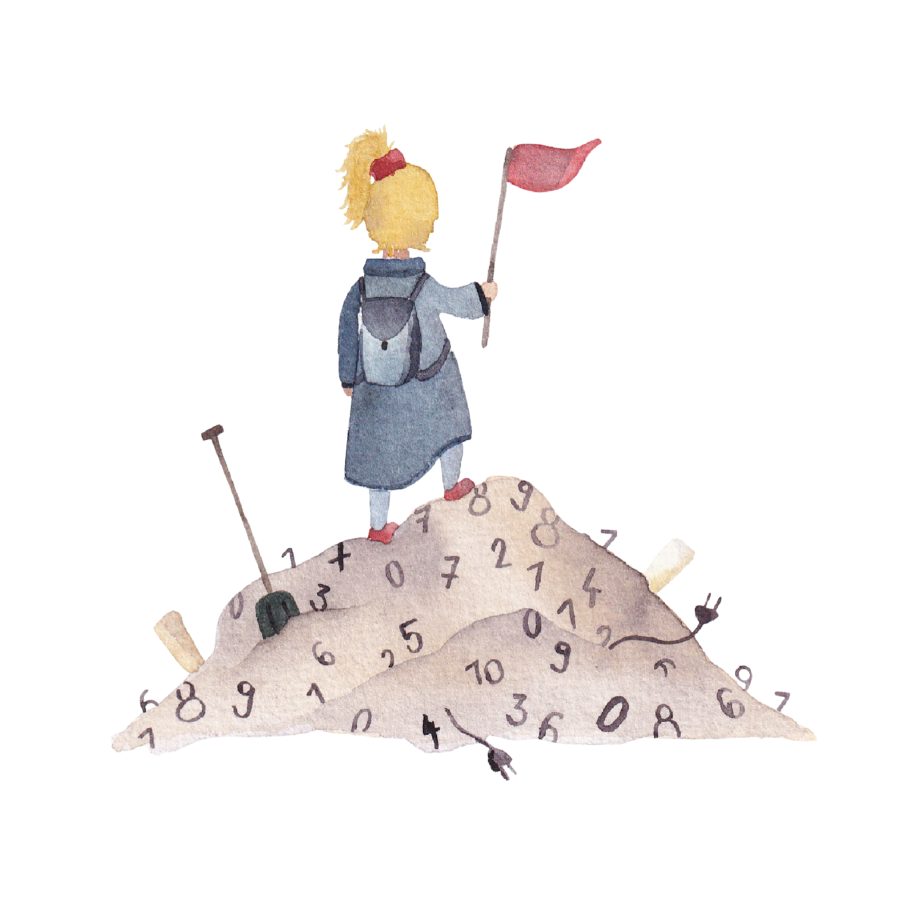](https://dccw.de)

[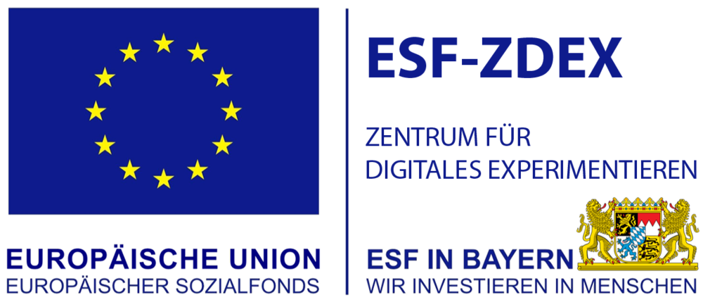](https://www.uni-wuerzburg.de/sft/esf-zdex)
[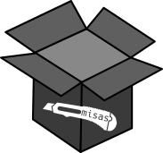](https://chfc-cmi.github.io/misas/)

[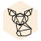](https://github.com/molbiodiv/fennec)
[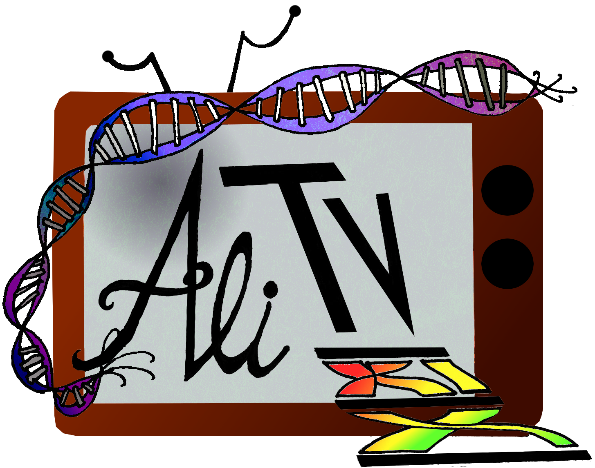](https://github.com/AliTVTeam/AliTV)
[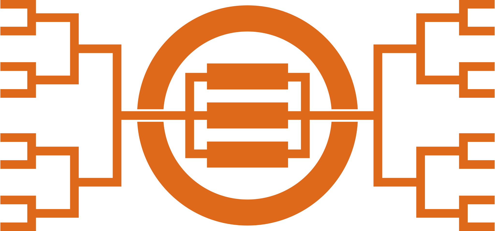](https://github.com/molbiodiv/bcdatabaser)

[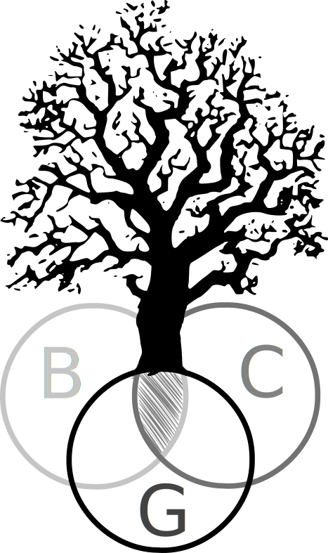](https://github.com/molbiodiv/bcgTree)
[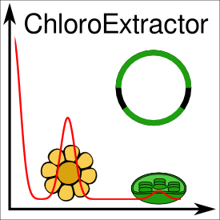](https://github.com/chloroExtractorTeam/chloroExtractor)
[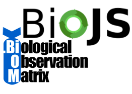](https://github.com/molbiodiv/biojs-io-biom)

[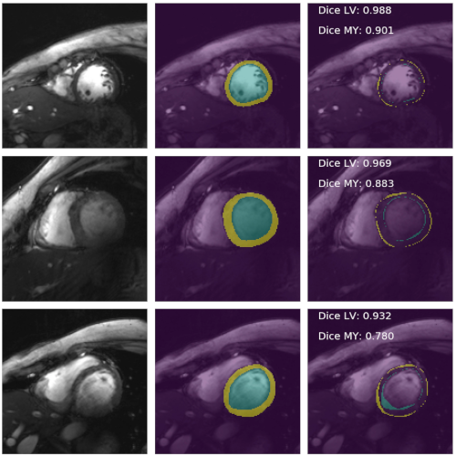](https://github.com/chfc-cmi/cmr-seg-tl)

[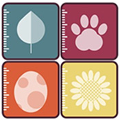](https://doi.org/10.1038/s41559-020-1109-6)
[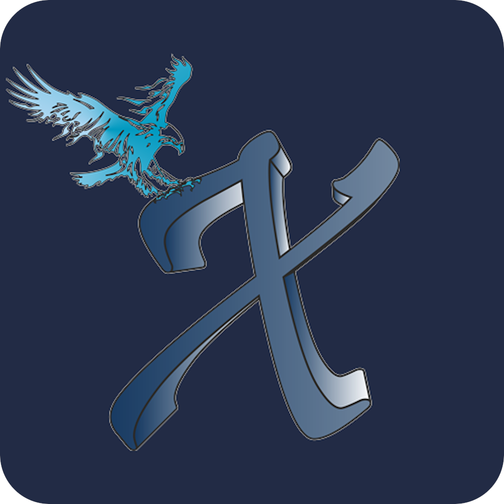](https://github.com/iimog/x-game-master)
[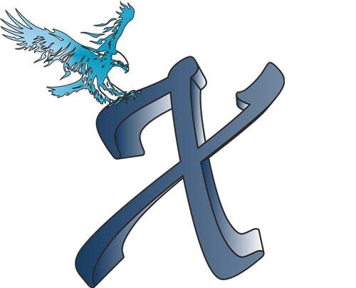](https://github.com/iimog/x-party-game)
[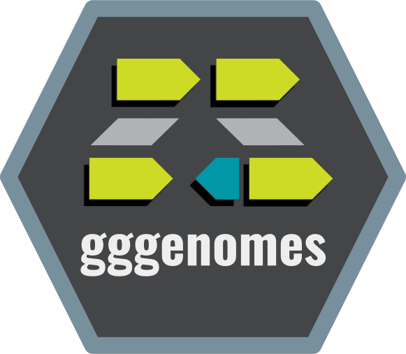](https://github.com/thackl/gggenomehttps://thackl.github.io/gggenomes)
