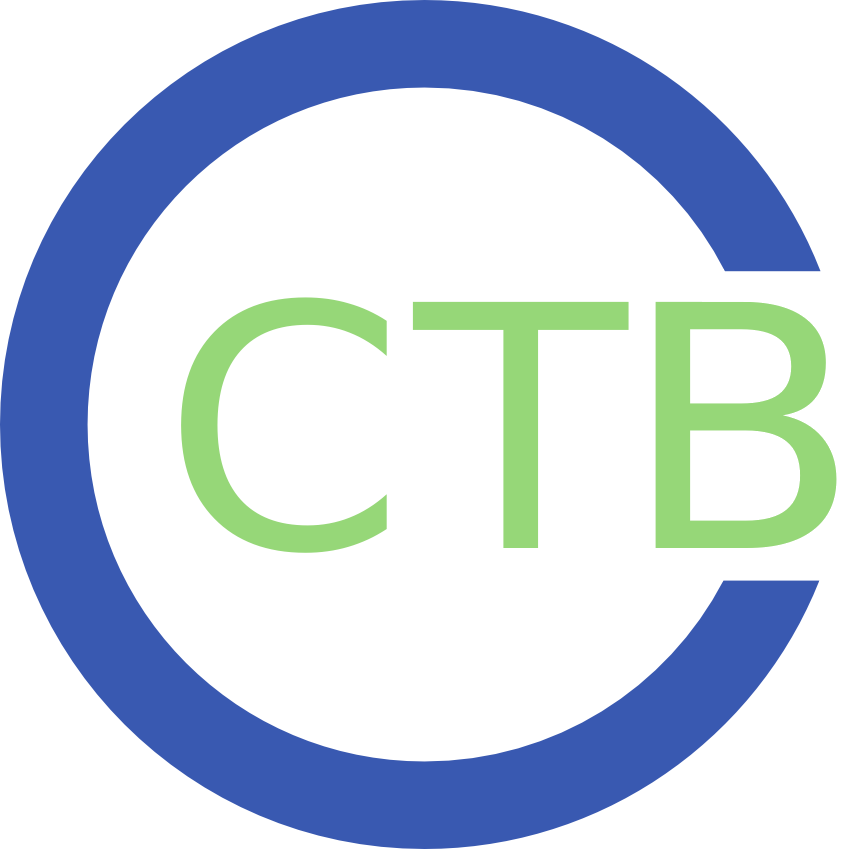
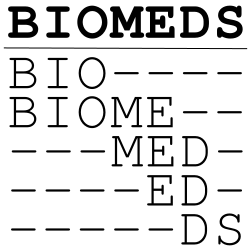
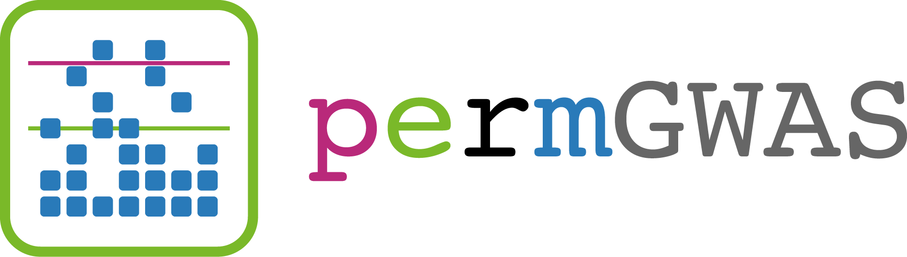
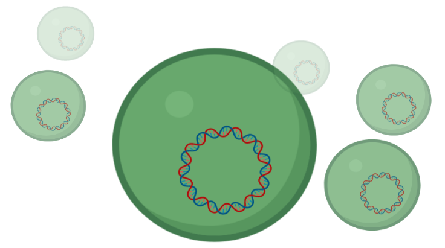

### Hi there 👋

I’m Markus, group leader of the [BioMedical Data Science group](https://www.biozentrum.uni-wuerzburg.de/cctb/research/biomedical-data-science/) at the [Center for Computational and Theoretical Biology (CCTB)](https://www.biozentrum.uni-wuerzburg.de/cctb/cctb/) at the [University of Würzburg](https://www.uni-wuerzburg.de).

My research interests are developing and applying algorithms, tools, and workflows to generate knowledge from biomedical data. Currently, I focus on the possibilities and limitations of machine learning and artificial intelligence in biomedical research. Additionally, I engage in knowledge transfer with local businesses as part of the [KIdT Project](https://www.informatik.uni-wuerzburg.de/forum-kidt).

- 💻 Projects and Activities: [Overview](https://github.com/iimog/iimog/blob/main/Projects.md)
- 🧑‍🔬 Scientific Papers: [Google Scholar](https://scholar.google.de/citations?user=Qroex8UAAAAJ)
- 🕵️ Reviews: [Web of Science (formerly Publons)](https://www.webofscience.com/wos/author/record/656742)
- 🍕 Meetups: [HackyHour Würzburg](https://hackyhour.github.io/Wuerzburg/), [Data Dojo](https://ddojo.github.io/)

<!--
**iimog/iimog** is a ✨ _special_ ✨ repository because its `README.md` (this file) appears on your GitHub profile.

Here are some ideas to get you started:

- 🔭 I’m currently working on ...
- 🌱 I’m currently learning ...
- 👯 I’m looking to collaborate on ...
- 🤔 I’m looking for help with ...
- 💬 Ask me about ...
- 📫 How to reach me: ...
- 😄 Pronouns: ...
- ⚡ Fun fact: ...
-->

### Projects and Activities

